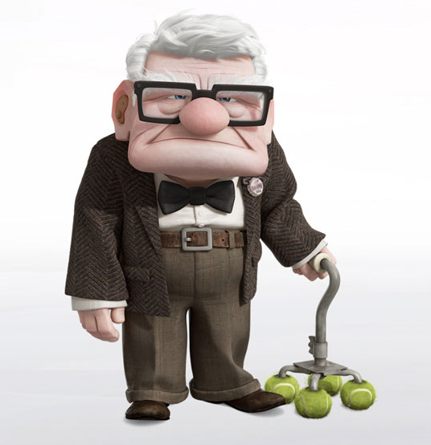

# Make the Up House in A-Frame!

Carl Fredricksen has decided he wants to honor his recently deceased wife by flying to places she always dreamed of. He has a plan. He's going to add balloons to his house until it flies away. He has calculated that if he adds 25 jumbo balloons to his house, he can get his house to lift off the ground. Your job is to help him to this.

## Your Task:
You can find a working example of what you will create <a href="https://twant.github.io/up-house/">here.</a> The steps to creating it are below!

1. Create a box next to the house. When clicked upon, the box should add a balloon sphere to a random location above the house. The spheres should be appended to the entity with the id of "house-balloons" 

2. Use a counter variable to keep track of how many balloons have been added above the house. When 25 balloons have been added, append an animation that makes the entire "house-balloons" entity (containing both the house and the balloons float upwards. 

## Bonus

3. Make each balloon also have a random color when added to the scene.

4. Create a string to attach each ballon to the house.

5. Make the balloon house float upwards, but also float away from the camera on the z-axis

6. Create another object that, when clicked, deletes balloons from the house. When the number of balloons goes below 25, the house should float back down. 
